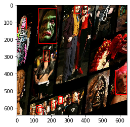

# Universal-Data-Augmerntation-for-Bounding-Boxes-
Avoid writing separate code for bounding box updation for each type of data augmentation for Object Detection pipelines. Optimized for integration with tf.data pipeline for GPU execution.

