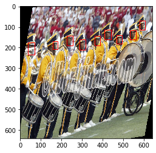
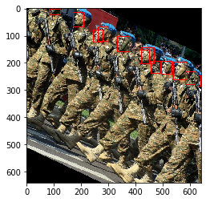

## Need for ease:

---

Working on Object Detection pipelines, one of the main aspects that need to be dealt with is Data Augmentation. As compared to image classification, any augmentation applied to images in your object detection dataset should also be mapped with their respective bounding boxes.

The preferred way would be to write code that maps the destination bboxes for separate augmentations. For example, an augmentation which horizontally flips the image would require to bbox coordinates also to be flipped. We could write code for the same. However, every time we add an augmentation we need to write additional code which could be time-consuming.

This repo introduces a universal scheme for mapping the bbox coordinates as per the augmentation. 

## Logic:

---

The logic is simple:

- Consider a face detection setup
- Every face in the image would have a bbox
- For the 'n' faces in the image we would have 'n' bboxes
- Each bbox is plotted separately on an new image channel. Let's call this 'label_img'
- The augmentations are applied to the 'label_img' and the bbox coordinates from the resulting 'label_img' after augmentation are recovered.

***The code has been written using TensorFlow ops so that it could be seamlessly integrated with tf.data pipeline.***

The results would look like this:

## Dataset:

---

Dataset used is  -> [WiderFace](http://shuoyang1213.me/WIDERFACE/)

## 📒 Please refer the Colab notebook for the full pipeline and demo.
