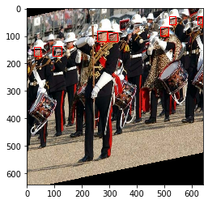

# Universal-Data-Augmerntation-for-Bounding-Boxes-
Avoid writing separate code for bounding box updation for each type of data augmentation in Object Detection pipelines. Optimized for integration with tf.data pipeline for GPU execution.

Dataset used -> [WiderFace](http://shuoyang1213.me/WIDERFACE/)

Please refer the Colab notebook for the full pipeline and demo.
